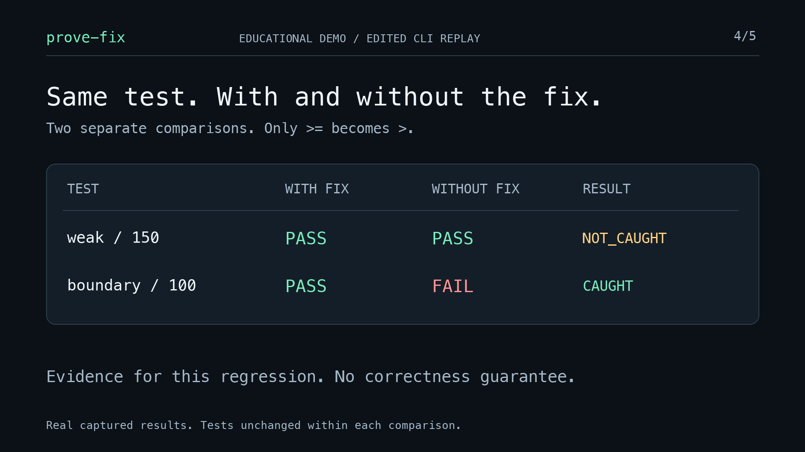

# prove-fix

**Your test is green. Put the bug back.**

An explicit regression-checking skill for Claude Code and Codex, with one bundled
Python helper. Check whether one pytest test notices a selected implementation fix
being reversed.

Run the **same test** against two independent snapshots of the current working
tree. Reverse **only the chosen implementation patch** in the second. Keep tests,
fixtures, configuration, and dependencies the same within each comparison.

[](media/prove-fix-demo.mp4)

[Watch the actual 20-second MP4](media/prove-fix-demo.mp4) ·
[Captured execution evidence](media/evidence/demo/summary.json) ·
[Media reproduction](media/README.md)

The video is an explicitly labeled, edited replay of real helper output from a
deterministic educational fixture. It does not depict an agent writing a weak
test by mistake. Execution time is independent of the edit's duration.

## Quickstart

Python 3.11+ and Git, on Linux or macOS. No package publication or API key required.

```bash
git clone https://github.com/grishahq/prove-fix.git
cd prove-fix
python3 -m venv .venv
.venv/bin/python -m pip install -r requirements-dev.txt
.venv/bin/python scripts/demo.py --out artifacts/demo
```

That last command creates a disposable Git fixture, explicitly includes its new
regression test, runs **two separate comparisons**, and saves sanitized evidence.
Existing output directories are refused; choose a new directory for another run.
Each comparison repeats both snapshots twice by default.

Actual saved results:

| Selected test | With fix | Only fix reversed | Result |
| --- | --- | --- | --- |
| `test_weak`, amount **150** | PASS | PASS | NOT_CAUGHT |
| `test_boundary`, amount **100** | PASS | FAIL at the intended assert | CAUGHT |

Free shipping starts at 100. The fix changes `amount > 100` to `amount >= 100`.
Switching from the weak test to the boundary test is a new comparison. Neither
test is rewritten within its comparison. The reversed boundary run captured:

```text
test_shipping.py:9: in test_boundary
    assert free_shipping(100) is True
E   assert False is True
E    +  where False = free_shipping(100)
```

## Install the skill

From the clone, project-local installation (into this project or another chosen
project root):

```bash
python3 scripts/install.py --agent claude --project . --dry-run
python3 scripts/install.py --agent claude --project .
python3 scripts/install.py --agent codex --project . --dry-run
python3 scripts/install.py --agent codex --project .
```

The destinations are `.claude/skills/prove-fix` and `.agents/skills/prove-fix`.
To use another project, replace `.` with that project's root. User-level install:

```bash
python3 scripts/install.py --agent claude --user --dry-run
python3 scripts/install.py --agent claude --user
python3 scripts/install.py --agent codex --user --dry-run
python3 scripts/install.py --agent codex --user
```

The destinations are `~/.claude/skills/prove-fix` and `~/.agents/skills/prove-fix`.
The installer never silently overwrites a skill, changes agent settings, or adds
tool permission grants. Move/remove an existing installation explicitly to update
it. `--user --home /tmp/chosen-test-home` supports isolated packaging tests.

Both installations contain the complete helper and runner; no development checkout
imports. Only Claude's frontmatter is adapted. Explicit invocation examples:

```text
Claude Code: /prove-fix Check the current shipping fix and test_boundary.
Codex:       $prove-fix Check the current shipping fix and test_boundary.
```

Claude's installer adds `disable-model-invocation: true`. Codex's
`agents/openai.yaml` sets `policy.allow_implicit_invocation: false`. These are
separate controls; one agent's metadata does not configure the other.

The paths and invocation policies were checked against the official
[Codex skills documentation](https://developers.openai.com/codex/skills/) and
[Claude Code skills documentation](https://code.claude.com/docs/en/skills) on
2026-09-29. See [validation notes](docs/validation.md) for the exact tested scope
and live-session outcomes. Restart/reload skills if the agent has not discovered
a newly installed directory.

## Use on a real fix

Invoke the skill after making a fix and adding a specific regression test. It
inspects the task/diff/tests, explains the selected reversal, runs the helper, and
reviews the assertion evidence. It stops when the fix cannot be isolated safely.

The helper accepts an **explicit forward implementation patch**. It does not
classify arbitrary PR hunks automatically. `--allow` must list exactly the changed
existing `.py` files. Select one exact pytest node ID and protect related tests,
fixtures, and config. New/untracked files need individual `--include` arguments.
All tracked content is read from the current working tree, including staged and
unstaged edits; files are never staged or committed by the helper.

[Full CLI interface, copying rules, and result contract](skills/prove-fix/references.md).
Run `.venv/bin/python skills/prove-fix/scripts/check.py --help` for every option.
The installed helper is resolved relative to the loaded skill, so invocation also
works from a different project.

The result includes a compact terminal report plus `report.json`, the actual
patch, snapshot/test hashes, commands, exit codes, durations, and captured
stdout/stderr and structured pytest reports. Observed facts and caller-supplied
bug interpretation are separate.

| Result | Helper exit | Meaning |
| --- | --- | --- |
| CAUGHT | 0 | Fixed passes; reversal raises AssertionError at the declared test assert in every run. Review its meaning before attributing it to the bug. |
| NOT_CAUGHT | 1 | This selected test ran and passed in both snapshots in these runs. |
| BASELINE_FAILED | 2 | The fixed snapshot consistently fails a supported assertion. |
| INCONCLUSIVE | 3 | Prerequisites, patch problems, no meaningful run, skip/xfail/xpass, setup/import errors, timeout, unexpected failure, mutated inputs, or inconsistent reruns. |

An arbitrary nonzero exit or stderr keyword never establishes CAUGHT. The expected
assertion is checked against the test's AST and the exception's originating frame.
A test line that merely called code raising an unrelated AssertionError is not
accepted as that test assertion failing. The agent must still inspect semantics.
SIGINT/SIGTERM clean up owned processes/copies and return 130; invalid CLI syntax
returns 2 before a report. See the reference for report-free input refusals.

## v0.1 scope and safety

- Python 3.11+, Linux/macOS, pytest 8.3–9.x, one in-process node ID. A selected
  parametrized case is supported. Third-party plugin autoload is disabled.
- Strict UTF-8/LF git-style diffs of existing `.py` files with exact hunk positions;
  no fuzzy application, file creation/deletion, renames, mode changes, binary
  patches, symlinks, submodules, conflicted index, or paths containing spaces.
- Standard library core; pytest is an already-installed test prerequisite.
  Tests requiring external services or custom environment variables are outside
  this small interface. No automatic installs, hooks, accounts, or telemetry.
- Temporary snapshots keep the checker's own edits away from the caller. They
  **are NOT a security sandbox for arbitrary project code**. Run only trusted
  repositories whose execution is authorized; respect existing agent permissions.
- Git internals, known credential filenames/directories, caches, environments,
  and agent settings are excluded even if tracked. Review inputs for secrets with
  arbitrary names and omit them with `--exclude`; name rules cannot detect secrets
  embedded in source. Do not copy credentials to make tests work.
- No reset, checkout, stash, clean, or other mutating Git operations are performed
  in the caller. Copied imports are checked; editable installs pointing to the
  caller are refused. Snapshot inputs are hashed before/after each test execution.

NOT_CAUGHT says this test missed this regression in these runs. CAUGHT provides
evidence that it catches this particular regression. **Neither establishes
overall correctness.** Finite reruns cannot prove the absence of flakiness.
This is a focused application of established regression/mutation-testing ideas,
not automatic test repair or a claim to invent those techniques.

## Develop and reproduce

```bash
.venv/bin/python -m pytest -q
.venv/bin/python scripts/demo.py --out artifacts/demo-repeat
```

[Repository development guidance](AGENTS.md) · [MIT license](LICENSE) ·
[Validation record](docs/validation.md) · [Video and captions](media/README.md) ·
[X post](launch/x-post.txt) · [LinkedIn post](launch/linkedin-post.md) ·
[Accessible alt text](launch/alt-text.txt)

The GitHub Actions workflow runs tests and fresh demo checks. Local test success
does not by itself establish that the remote workflow passed. Live authenticated
agent smoke tests are opt-in and excluded from CI and the deterministic demo.
